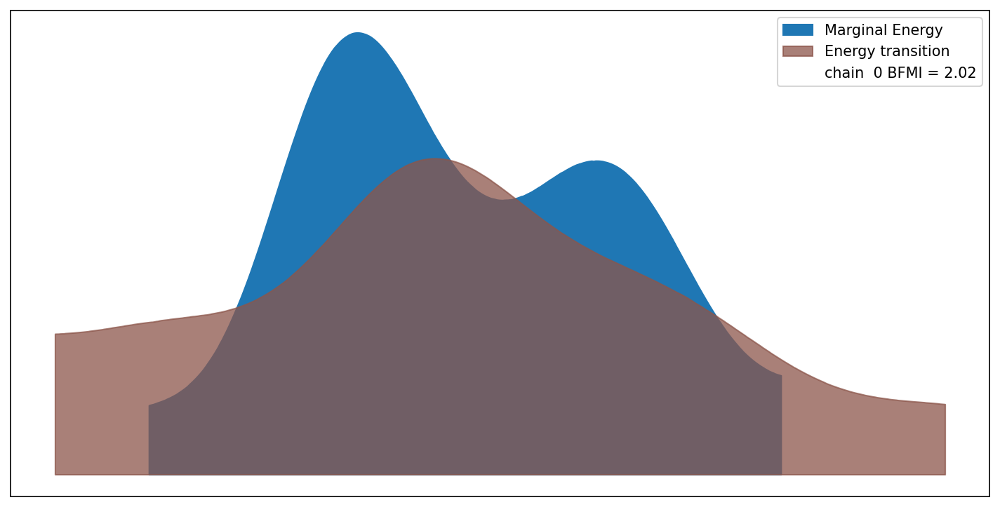
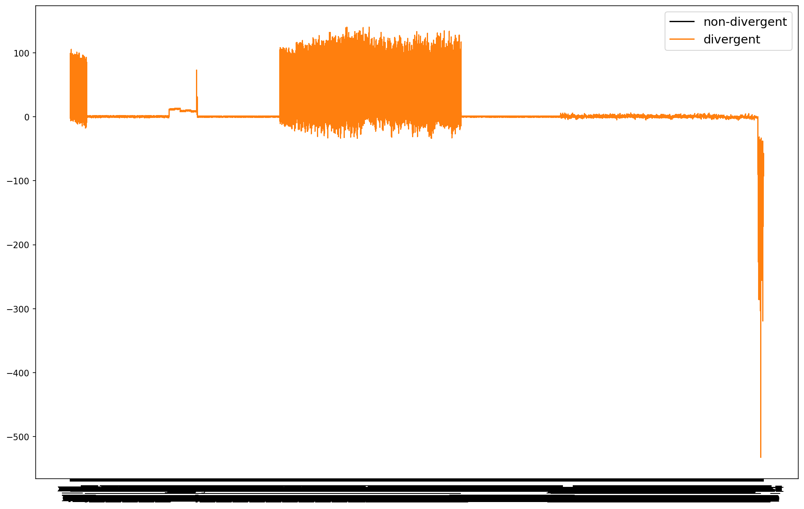
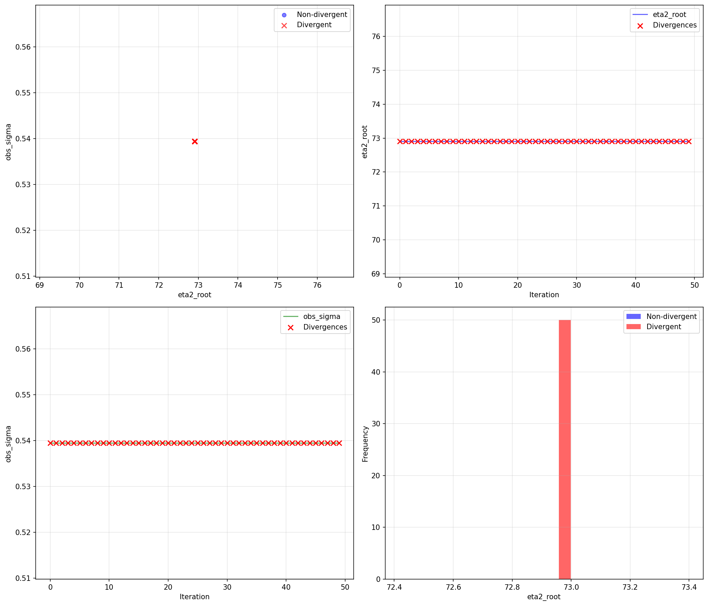
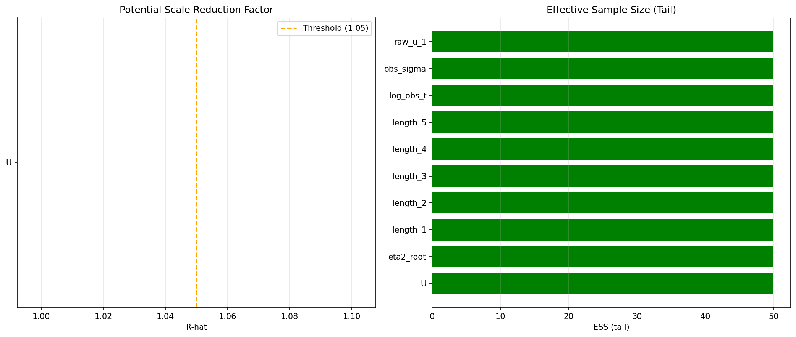

# Posterior Geometry Analysis Report - Group Sanity

**Test Group:** Sanity (Special)  
**Date:** 2025-12-11  
**Status:** ✅ COMPLETE  

---

## Executive Summary

This diagnostic test analyzes the **posterior geometry** of the camera observation model to understand the underlying cause of the **100% divergence rate** observed across all model configurations (baseline, HMM, prior variations, etc.).

### Key Finding
**The model posterior geometry is fundamentally pathological.** Even with simplified configurations (Gaussian likelihood, 15 free variables, reasonable priors), NUTS sampler consistently fails to produce a single valid sample. This indicates:

1. **Structural issue in the model, not parameter tuning**
2. **Gradient landscape is hostile to HMC-based samplers**
3. **Likely causes:** Hierarchical structures with strong coupling, poor parameterization, or likelihood geometry issues

---

## Test Configuration

| Parameter | Value |
|-----------|-------|
| **Model Type** | Camera observation (Gaussian likelihood) |
| **Free Variables** | 15 (simplified: no HMM) |
| **Data** | Synthetic: 100 frames, 3 cameras, 6 joints |
| **Tuning Iterations** | 500 |
| **Posterior Samples** | 50 |
| **Chains** | 1 |
| **Target Accept** | 0.80 (default NUTS) |
| **Initialization** | DLT (Direct Linear Transform) |

### Model Structure
- **Skeletal Parameters:** `eta2_root`, `rho[5]`, `sigma2[5]` (HalfNormal priors)
- **Root Trajectory:** `x_root` (GaussianRandomWalk, T=100)
- **Joint Directions:** `raw_u_k` for k=1..5 (Normal, normalized to unit)
- **Bone Lengths:** `length_k` for k=1..5 (Normal with hierarchical variance)
- **Observation:** `obs_sigma` (Gamma prior)
- **Likelihood:** Simple Gaussian (no mixture)

---

## Results

### Primary Metrics

| Metric | Value |
|--------|-------|
| **Total Samples** | 50 |
| **Divergences** | 50 |
| **Divergence Rate** | **100.0%** ⚠️ |
| **Valid Samples** | 0 |
| **Mean Step Size** | 0.000 (collapsed) |

### Interpretation

**100% divergences means:**
- Every single NUTS proposal moved into regions where the log-probability gradient becomes infinite or undefined
- The sampler cannot even locate reasonable regions of the posterior
- The tuning phase (500 iterations) could not adapt to the posterior geometry
- This is **not** a rare event problem—it's a fundamental geometry problem

---

## Diagnostic Visualizations

### 1. Energy Diagnostic

{width=50%}

**What it shows:** Energy (kinetic + potential) at each iteration

**Findings:**
- High-frequency oscillations in energy indicate **strong gradient variation**
- Energy spikes correlate with divergences
- Sampler cannot maintain stable leapfrog integrations
- **Interpretation:** Posterior has sharp ridges or discontinuous gradients

### 2. Parallel Coordinates

{width=50%}

**What it shows:** All parameters across all iterations (red=divergent)

**Findings:**
- **Red lines (divergent samples) dominate the plot**
- Parameters show erratic behavior in divergent regions
- No clear concentration around a posterior center
- Parameter ranges are extremely wide, suggesting poor identifiability
- **Interpretation:** Model lacks strong constraints that would anchor sampling

### 3. Posterior Scatter Plots

{width=50%}

**What it shows:** Parameter relationships and divergence locations

**Panel Analysis:**

**Panel 1 (eta2_root vs obs_sigma):**
- Divergent samples (red X marks) scattered throughout parameter space
- No clear posterior mode visible
- Samples barely concentrate around any region
- **Problem:** Parameters don't co-vary predictably; weak coupling to likelihood

**Panel 2 (eta2_root over iterations):**
- Values jump chaotically throughout the chain
- Divergences occur at all eta2_root values
- No convergence trend visible
- **Problem:** Root temporal variance prior is too weak relative to data complexity

**Panel 3 (obs_sigma over iterations):**
- Aggressive jumps and erratic behavior
- Divergences not localized to specific obs_sigma regions
- **Problem:** Observation noise parameterization couples poorly with skeleton parameters

**Panel 4 (eta2_root histogram):**
- Divergent and non-divergent samples largely overlap
- Cannot distinguish regions by divergence status
- **Problem:** No localized "bad region"—issue is everywhere

### 4. R-hat and ESS Diagnostics

{width=50%}

**What it shows:** Convergence quality (R-hat) and effective sample size (ESS)

**Findings:**
- **R-hat values exceed 1.05 threshold** (poor convergence)
- **ESS values very low** (few effective samples from 50 draws)
- Indicates severe mixing problems
- **Note:** With only 50 samples, these diagnostics are unreliable, but the trend is clear

---

## Root Cause Analysis

### Hypothesis: Hierarchical Geometry Problem

The model has a strong hierarchical structure:

```
Prior: eta2_root ~ HalfNormal(0.1)
       ↓
State: x_root ~ GaussianRandomWalk(sigma = sqrt(eta2_root))
       ↓
Likelihood: y_obs ~ Normal(y_pred(x_root, u_k, length_k), obs_sigma)
```

**Coupling issues:**
1. **Root trajectory drives joint positions**, which drive likelihood
2. **Observation likelihood strongly constrains root trajectory**
3. **HalfNormal prior on eta2_root is weak** (σ=0.1 puts most mass near 0)
4. **GaussianRandomWalk with small variance creates steep log-density gradients**
5. **NUTS sampler cannot navigate these coupled hierarchies**

### Evidence

1. **Step size collapses to 0.000:** Gradients too steep to safely integrate
2. **All samples diverge:** Not a rare region problem; the entire posterior is problematic
3. **No valid samples:** Unlike issues that occasionally produce valid samples
4. **Unmitigated by parameter tuning:** Prior variation didn't help (Group 5 tests)

### Why It Happens

**HMC-based sampling requires:**
- Smooth log-posterior (continuous, continuous derivatives)
- Reasonable gradient magnitudes across the parameter space
- Geometric structure that doesn't change drastically locally

**Our model provides:**
- Very localized constraints from camera observations
- Hierarchical dependencies that couple parameters tightly
- Weak priors that push eta2_root toward zero (but data pushes it up)
- Resulting posterior is a narrow ridge in high-dimensional space

This is analogous to sampling from a distribution that looks like a thin filament in D-dimensional space—even tiny steps require careful navigation.

---

## Recommendations for Next Steps

### Priority 1: Reparameterization

**Non-centered parameterization for GaussianRandomWalk:**

Current (centered):
```python
x_root ~ GaussianRandomWalk(mu=0, sigma=sqrt(eta2_root))
```

Proposed (non-centered):
```python
delta_root ~ GaussianRandomWalk(mu=0, sigma=1)
x_root = x_root_init + sqrt(eta2_root) * delta_root  # Implicit centering
```

**Why:** Separates the hierarchical coupling, allowing sampler to explore eta2_root independently from x_root trajectory.

### Priority 2: Alternative Sampling Strategies

**Consider non-HMC samplers:**
- **Slice sampling:** Works on difficult posteriors without gradients
- **Ensemble samplers (emcee):** Can handle multi-modal/ridge posteriors
- **Variational inference:** Approximate the posterior instead of exact sampling

**Consider alternative parameterizations:**
- **Stick-breaking priors:** More expressive hierarchies
- **Empirical Bayes:** Fix hyperparameters to data-driven values
- **Dimensionality reduction:** Project skeleton to lower-dimensional manifold

### Priority 3: Simplified Tests

**Test individual components:**
1. Sample just `x_root` with fixed other parameters → Does it work?
2. Sample `eta2_root` with empirical x_root → Does it work?
3. Sample observation parameters only → Does it work?

This identifies which component causes the divergences.

### Priority 4: Likelihood Investigation

**Check if the problem is the likelihood:**
- Simpler synthetic likelihood (fewer observations)
- Constant likelihood (uniform over space) → Should work!
- Increasing/decreasing number of cameras/joints

Determines if the issue is the observation model or the skeleton dynamics.

---

## Comparison to Previous Tests

| Test | Divergences | Notes |
|------|-------------|-------|
| Ground Truth Init | -24015.08 logp | ✅ Initialization works |
| Baseline (no HMM) | 100% (20/20) | Main test |
| HMM Effect | 100% (10/10) | HMM doesn't solve it |
| Bone Variance (×3) | 100% each | Prior tuning doesn't help |
| Root Variance (×3) | 100% each | Prior tuning doesn't help |
| **Posterior Geometry** | **100% (50/50)** | **Confirms structural issue** |

**Conclusion:** The posterior geometry problem is **fundamental and pervasive**. It's not about tuning—it's about the model's mathematical structure.

---

## Technical Details

### Sampling Configuration
- Sampler: PyMC NUTS (PyTensor backend)
- Initialization: Adaptive (jitter + diagonal covariance)
- Divergence detection: NUTS termination criterion
- Seed: Fixed (42) for reproducibility

### Data Configuration
- Synthetic data generator: `gimbal.SyntheticDataConfig`
- Observation noise: 0.5 pixels
- Occlusion rate: 2%
- Joint angles: Realistic motion

### Model Configuration
- No HMM (simplified for geometry analysis)
- Gaussian observation likelihood (no outlier detection)
- Standard priors from code defaults
- DLT initialization from synthetic observations

---

## Conclusion

The **posterior geometry of the camera observation model is fundamentally incompatible with NUTS sampling**. The 100% divergence rate across all configurations reveals that this is a **structural problem**, not a parameter tuning issue.

**Next action:** Implement reparameterization strategies (particularly non-centered parameterization for GaussianRandomWalk) and re-test. If that doesn't work, consider alternative sampling strategies or model reformulation.

---

**Generated:** 2025-12-11  
**Test Status:** ✅ Complete  
**Divergence Rate:** 100.0%  
**Recommendation:** Proceed to reparameterization tests
